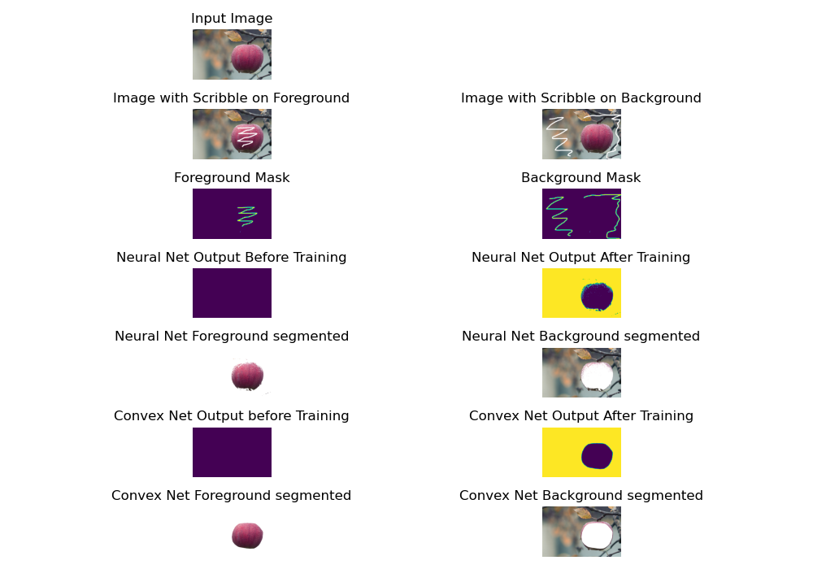

# Scribble-based Image Segmentation with Convexity Prior



## Introduction

The objective is to design a neural network architecture that can segment convex objects into the foreground and background of an image based on user-provided scribbles, incorporating a convexity prior. Convexity prior refers to the assumption that objects or regions in an image are often convex in shape, meaning they have a smooth and continuous boundary without concave regions.
This has been accomplished using two approaches:
• Approach 1: Generating the convex segmented image using fully connected network and convex network architecture.
• Approach 2: : Generating the convex segmented image using pre-trained segmentation network and convex network architecture.

## Requirements

See requirements.txt file

## Setup

1.  Install PyTorch and other required python libraries in a virtual environment with:

    ```
    pip install -r requirements.txt
    ```

2.  Collect Data:

    Foreground and background scribbles to be made on Image that need to be segmented. Save them in the data folder.

    For example data floder contains folder single_apple that contains the input image, scribble_fg and scribble_bg.
    
    All the data to be stored in the similar way.
    

## Usage

`python main.py` executes and runs the code with all the defaults arguments.

For changing the default arguments follow the below instructions:

1. Input: Folder of the image which needs to be segmented to be proved here.

    `python main.py --inputpath data/single_apple/`

2. Primary model selection: 

    Neural net as primary model: `python main.py -pm neuralnet`

    Segmentation net as primary model : `python main.py -pm segmentationnet`

3. Primary model parameters:
    
    Batch size, epochs, learning rate, hidden units are some of the neural net parameters that can be altered through command line.

    `python main.py -pm neuralnet -nnbs 64 -nne 100 -nnlr 0.00001 -nnhu 256`

    Batch size, epochs, learning rate are some of the segmentation net parameters that can be altered through command line.
    `python main.py -pm segmentationnet -snbs 64 -sne 100 -snlr 0.0001`

4. Convex net parameters:
    
    Batch size, epochs, learning rate, hidden units are some of the convex net parameters that can be altered through command line.
    
    `python main.py -pm neuralnet -nnbs 64 -nne 100 -nnlr 0.00001 -nnhu 256 -cnbs 64 -cne 50 -cnlr 0.00001 -cnhu 256`
    `python main.py -pm segmentationnet -snbs 64 -sne 100 -snlr 0.0001 -cnbs 64 -cne 50 -cnlr 0.00001 -cnhu 256`

## Outputs

The output of the network is saved in repective data folder. Output contains result.png, model configurations, terminal output and logs of tensorboard.
